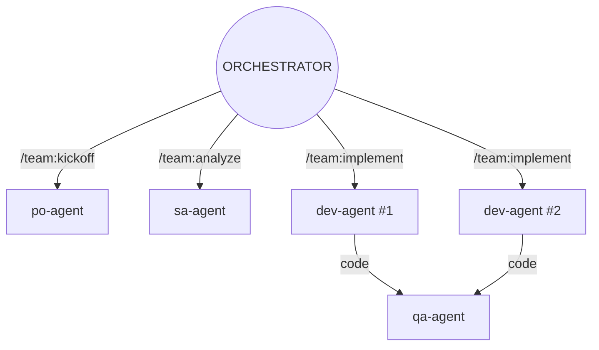
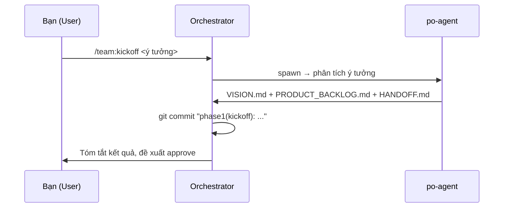
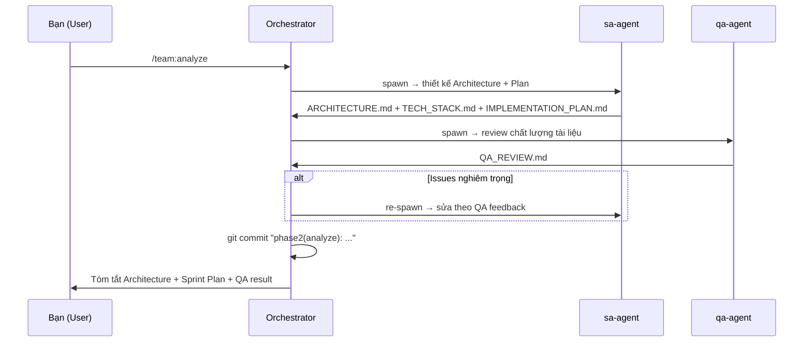
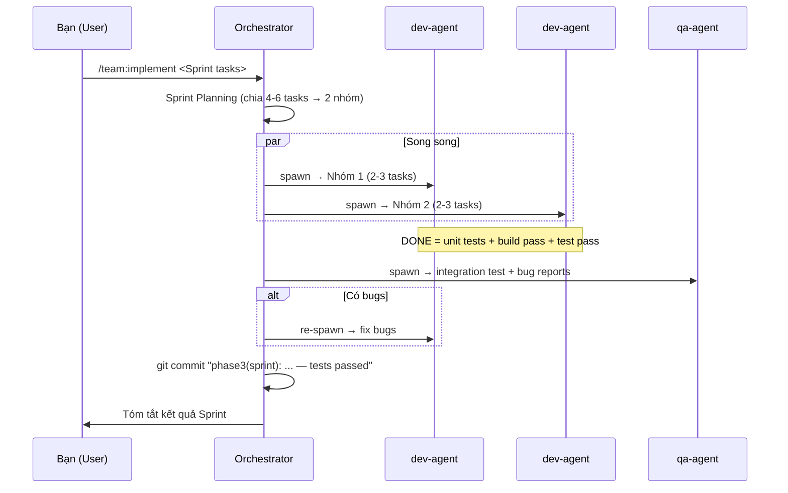
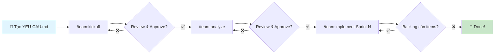

# 📘 TUTORIAL: Tạo và Sử dụng SubAgent Team với Gemini CLI

> **Mục tiêu**: Hướng dẫn từng bước cách tạo một Team SubAgents theo mô hình Agile/Scrum bằng cách chat với Antigravity, và sau đó sử dụng Team đó để phát triển phần mềm.

---

## Mục lục

- [PHẦN 1: Tạo ra SubAgent Team](#phần-1-tạo-ra-subagent-team)
  - [Session 1: Tìm hiểu giá trị của SubAgents](#session-1-tìm-hiểu-giá-trị-của-subagents)
  - [Session 2: Thiết kế Team Structure](#session-2-thiết-kế-team-structure)
  - [Session 3: Soạn yêu cầu + Triển khai SubAgents](#session-3-soạn-yêu-cầu--triển-khai-subagents)
- [PHẦN 2: Sử dụng SubAgent Team](#phần-2-sử-dụng-subagent-team)

---

# PHẦN 1: TẠO RA SUBAGENT TEAM

> **Công cụ**: Chat với Antigravity (trong VS Code / Cursor / IDE có tích hợp)
>
> **Lưu ý quan trọng**: Mỗi Session Chat là một phiên hội thoại liên tục — bạn có thể gửi nhiều message trong cùng một session. Giữa các Session khác nhau, bạn cần mở hội thoại mới (`/clear` hoặc new chat).

---

## Session 1: Tìm hiểu giá trị của SubAgents

> **Mục đích**: Hiểu rõ lợi ích của việc dùng SubAgents trước khi bắt tay vào xây dựng.

### 💬 Message 1 (duy nhất trong session này):

```
Việc phát triển một phần mềm có sử dụng SubAgents và không sử dụng SubAgents
---> cái nào ưu việt hơn?
```

### 📝 Kết quả mong đợi:

Antigravity sẽ phân tích so sánh hai cách tiếp cận:

| Tiêu chí          | Không SubAgents          | Có SubAgents                    |
| :---------------- | :----------------------- | :------------------------------ |
| Quy mô phù hợp    | Nhỏ, đơn giản            | Trung bình → Lớn                |
| Tốc độ phát triển | Nhanh khi đơn giản       | Song song hóa → nhanh hơn       |
| Chất lượng        | Phụ thuộc con người      | Có QA Agent kiểm soát tự động   |
| Mở rộng           | Khó khi context phình to | Mỗi agent scope riêng, dễ scale |
| Chi phí quản lý   | Thấp                     | Cần thiết kế workflow ban đầu   |

> **Takeaway**: Với dự án ≥ 3 man-month, SubAgents giúp song song hóa và kiểm soát chất lượng tốt hơn đáng kể.

---

## Session 2: Thiết kế Team Structure

> **Mục đích**: Yêu cầu Antigravity thiết kế mô hình team Scrum bằng SubAgents, có biểu đồ trực quan.

### 💬 Message 1:

```
Tôi muốn tạo ra một Team bao gồm các SubAgents để phát triển phần mềm
với quy mô 3 man-month. Sử dụng quy trình Agile / Scrum.
Hãy liệt kê các roles trong team Subagents đó: tên roles, vai trò
của từng members, các giai đoạn phát triển phần mềm và quy trình phối hợp.
Hãy viết thành docs: SCRUM-SUBAGENTS.md
```

### 💬 Message 2 (thiết lập quy tắc dự án):

```
Viết tài liệu bằng tiếng Việt nhé, hãy viết GEMINI.md và nói rõ:
./docs là thư mục chứa tài liệu hệ thống, và tài liệu phải viết bằng tiếng Việt.
Chỉ dẫn ghi trong GEMINI.md bằng Tiếng Anh và viết ngắn gọn.
```

> **Giải thích**: `GEMINI.md` là file cấu hình đặc biệt của Gemini CLI — agent sẽ đọc file này ở đầu mỗi session để hiểu quy tắc dự án. Viết bằng tiếng Anh để tối ưu token.

### 💬 Message 3 (yêu cầu trực quan hóa):

```
Bạn viết nhiều chữ quá, viết nhiều chữ cũng được nhưng hãy sử dụng
mermaid để vẽ biểu đồ cho tôi nhìn và dễ hình dung hơn.
```

### 💬 Message 4 (fix lỗi Mermaid nếu có):

```
Sửa lại mermaid chart đi bạn, sử dụng skill mermaid expert
tôi vừa feed cho bạn
```

> **Mẹo**: Nếu Mermaid bị lỗi parse, paste lỗi cụ thể cho Antigravity:
>
> ```
> Sửa lỗi chỗ này::: Parse error on line 6:
> ...       PO[PO Agent\n(Product Owner)]:::m
> -----------------------^
> Expecting 'SQE', 'DOUBLECIRCLEEND', 'PE', ...
> ```

### 📝 Kết quả mong đợi:

Hai file được tạo ra:

1. **`GEMINI.md`** (root) — Quy tắc dự án bằng tiếng Anh
2. **`docs/SCRUM-SUBAGENTS.md`** — Mô tả team với biểu đồ Mermaid:



---

## Session 3: Soạn yêu cầu + Triển khai SubAgents

> **Mục đích**: Tạo tài liệu yêu cầu, rồi yêu cầu Antigravity tạo cấu trúc SubAgents thực tế (files `.md` và `.toml`).

### 💬 Message 1 (soạn yêu cầu):

```
Hãy soạn tài liệu yêu cầu YEU-CAU.md => Từ đó sẽ lấy dữ liệu
spot trading của Binance về MEXC cho cặp ETH/USDT và lưu trữ lại
ở một dạng Database mà sau này có thể so sánh timeseries sự sai khác
giữa 2 limit orderbook của 2 sàn MEXC và Binance.
```

> **Lưu ý**: Nếu agent đề xuất tech phức tạp, hãy giữ đơn giản:
>
> ```
> Dùng SQLite thôi bạn hiền!
> ```

### 💬 Message 2 (tạo SubAgents):

```
Tôi muốn tạo ra một team bao gồm các subagents như mô tả trong tài liệu
SCRUM-SUBAGENTS.md, bạn hãy đọc kỹ về Gemini Extensions phần SubAgents
để biết phải tạo cấu trúc thư mục và các files làm sao để đạt được
yêu cầu này.

Ghi nhớ: Các SubAgents cần phải được chỉ dẫn và có tính cách giống
như được mô tả trong tài liệu SCRUM-SUBAGENTS.md

==> Nếu có gì không hiểu, hãy hỏi tôi kỹ chứ đừng tự bịa ra
---> ăn chửi đấy!
```

> **Giải thích**: Câu cuối cực kỳ quan trọng! Agent AI thường "tự bịa" khi không chắc chắn — yêu cầu rõ ràng "hãy hỏi lại" sẽ giảm hallucination đáng kể.

### 💬 Message 3 (yêu cầu workflow vận hành):

```
Bây giờ đã tạo các roles rồi, thế nhưng sản xuất phần mềm thì tôi biết
khi nào gọi roles nào? Bạn phải làm sao cho tôi là người vận hành team
tôi chỉ cần làm gọn gàng nhất thôi, giờ tôi còn biết gọi ông agents
nào lên và giao việc cho ổng như nào.
```

### 💬 Message 4 (chỉnh sửa quy trình):

```
Không đúng! Hãy xem xét lại quy trình phát triển phần mềm tiêu chuẩn
bằng Agile và Scrum, giai đoạn đầu sẽ là kickoff? Rồi đến phân tích
và trả về tài liệu kiến trúc, kế hoạch triển khai ==> Rồi mới đến
implement và test (lặp qua lại các Iterations) ==> Hãy xem xét kỹ lại,
nếu cần thiết hãy cập nhật tài liệu SCRUM-SUBAGENTS.md
```

### 💬 Message 5 (tinh chỉnh workflow):

```
Workflow cần gọn gàng đơn giản hơn:
1/ Kickoff
2/ Analyze
3/ Implement (sprint planning + dev + QA ==> Các agents tự phải viết
   handoff để rút kinh nghiệm y hệt như sprint daily meetup)

Hãy lưu ý: Các SubAgents sẽ có maxNumTurns = 15 thôi, không xong
thì phải trả handoff về cho orchestrator và orchestrator sẽ PHẢI
TẠO ISSUE VÀ BỎ VÀO BACKLOG ITEMS để triển khai ở sprint sau.
```

### 💬 Message 6 (triển khai commands):

```
Giờ hãy triển khai, sửa lại commands
```

### 💬 Message 7 (fix lỗi agent loading):

```
Fix these error:::
✕ Agent loading error: Failed to load agent from
  .gemini/agents/dev-agent.md: Validation failed: Agent Definition:
  tools.1: Invalid tool name
  tools.4: Invalid tool name
...
```

> **Mẹo**: Paste nguyên error log cho Antigravity — nó sẽ tự biết cách fix. Lỗi thường gặp nhất là dùng sai tên tool (ví dụ `write_to_file` → `write_file`).

### 💬 Message 8 (bổ sung QA vào analyze + fix implement):

```
1) Trong workflow analyze.toml, cần bổ sung thêm QA vào để review
   chất lượng của các tài liệu phân tích

2) Trong workflow implement.toml được hiểu là triển khai các tasks
   cho mỗi sprint, ở đây cần phải spawn cùng một lúc nhiều subagents
   ==> Hiện tại workflow implement.toml bạn viết hoàn toàn không
   spawn lên subagents. Hãy xem xét kỹ lại.
```

### 💬 Message 9 (git commit + parallel dev):

```
1) Thêm yêu cầu: mỗi khi xong một workflow cần phải commit git local
   changes với commit message phù hợp để dễ dàng tracing về sau.

2) Trong implement.toml cần xem xét spawn 2 dev agents cùng một lúc
   để thực hiện được nhiều task hơn trong một iteration (Sprint),
   và dev chỉ được coi là xong khi đã viết xong unit test, fix các
   bugs build và run test passed rồi mới hoàn thành task.
   ==> Cập nhật cả TEAM-WORKFLOW.md, SCRUM-SUBAGENTS.md và commands.
```

### 📝 Kết quả cuối cùng — Cấu trúc project:

```
geminicli-subagent02/
├── GEMINI.md                          # Quy tắc dự án
├── docs/
│   ├── SCRUM-SUBAGENTS.md             # Mô hình team + quy trình
│   └── TEAM-WORKFLOW.md               # Hướng dẫn vận hành 3 commands
├── .gemini/
│   ├── agents/                        # 4 SubAgents
│   │   ├── po-agent.md                # Product Owner
│   │   ├── sa-agent.md                # Solution Architect
│   │   ├── dev-agent.md               # Developer (Full-stack)
│   │   └── qa-agent.md                # Quality Assurance
│   └── commands/team/                 # 3 Workflow Commands
│       ├── kickoff.toml               # /team:kickoff
│       ├── analyze.toml               # /team:analyze
│       └── implement.toml             # /team:implement
```

### 🔑 Chi tiết từng SubAgent:

| Agent         | Model          | Temp | Max Turns | Tính cách                                            |
| :------------ | :------------- | :--- | :-------- | :--------------------------------------------------- |
| **po-agent**  | gemini-2.5-pro | 0.3  | 15        | Tỉ mỉ, hướng giá trị, kiên quyết về ưu tiên          |
| **sa-agent**  | gemini-2.5-pro | 0.2  | 15        | Tư duy hệ thống, thực dụng (KISS > Over-engineering) |
| **dev-agent** | gemini-2.5-pro | 0.2  | 15        | Cẩn thận, test-driven, tự phê                        |
| **qa-agent**  | gemini-2.5-pro | 0.1  | 15        | Hoài nghi lành mạnh, chi tiết đến từng pixel         |

> **Lưu ý temperature**: PO có temp cao nhất (0.3) vì cần sáng tạo khi phân tích yêu cầu. QA thấp nhất (0.1) vì cần chính xác tuyệt đối.

---

# PHẦN 2: SỬ DỤNG SUBAGENT TEAM

> **Điều kiện**: Bạn đã có đầy đủ cấu trúc SubAgents như Phần 1.
>
> **Tool**: Gemini CLI (chạy `gemini` trong terminal tại thư mục project)

---

## Bước 1: Tạo tài liệu yêu cầu

Trước khi chạy team, bạn cần có file `docs/YEU-CAU.md` mô tả ý tưởng dự án.

```markdown
# Yêu cầu dự án

## Mô tả

[Mô tả ngắn gọn ý tưởng dự án]

## Tính năng chính

- [Feature 1]
- [Feature 2]
- ...

## Yêu cầu kỹ thuật

- [Ngôn ngữ / Framework]
- [Database]
- [API / Integrations]

## Phạm vi MVP

- [Những gì CẦN có trong MVP]
- [Những gì KHÔNG cần trong MVP]
```

---

## Bước 2: Phase 1 — Kickoff

```bash
/team:kickoff <mô tả ý tưởng dự án>
```

**Ví dụ:**

```
/team:kickoff Hệ thống so sánh orderbook ETH/USDT giữa Binance và MEXC,
lưu SQLite, hiển thị timeseries diff
```

**Điều gì xảy ra:**



**Output được tạo:**

- `docs/VISION.md` — Tầm nhìn sản phẩm, đối tượng, phạm vi MVP
- `docs/PRODUCT_BACKLOG.md` — User Stories với Acceptance Criteria
- `docs/HANDOFF.md` — Báo cáo trạng thái

**Sau khi xong:**

```bash
/clear                    # Clear context cho session mới
git log --oneline -3      # Kiểm tra commit
```

> ⚠️ **Review**: Đọc `VISION.md` và `PRODUCT_BACKLOG.md`. Nếu chưa đúng ý, sửa tay hoặc chạy lại kickoff.

---

## Bước 3: Phase 2 — Analyze

```bash
/team:analyze <yêu cầu bổ sung nếu có>
```

**Ví dụ:**

```
/team:analyze Ưu tiên Python + SQLite, WebSocket cho realtime data
```

**Điều gì xảy ra:**



**Output được tạo:**

- `docs/ARCHITECTURE.md` — Kiến trúc hệ thống (có Mermaid diagrams)
- `docs/TECH_STACK.md` — ADR, so sánh tech stack
- `docs/IMPLEMENTATION_PLAN.md` — Sprint plan, task breakdown
- `docs/QA_REVIEW.md` — Đánh giá chất lượng tài liệu

**Sau khi xong:**

```bash
/clear
git log --oneline -3
```

> ⚠️ **Review**: Đọc `ARCHITECTURE.md` và `IMPLEMENTATION_PLAN.md`. Đây là bản thiết kế — sai ở đây thì implement sẽ sai.

---

## Bước 4: Phase 3 — Implement (lặp nhiều Sprint)

```bash
/team:implement <mô tả tasks cho Sprint này>
```

**Ví dụ:**

```
/team:implement Sprint 1: Setup project structure + Binance WebSocket client + SQLite schema
```

**Điều gì xảy ra:**



**Output được tạo:**

- Source code + unit tests
- `docs/HANDOFF_DEV1.md` — Báo cáo Dev nhóm 1
- `docs/HANDOFF_DEV2.md` — Báo cáo Dev nhóm 2
- `docs/HANDOFF_QA.md` — Kết quả QA
- `docs/BUG_REPORT.md` — (nếu có bugs)

**Sau khi xong:**

```bash
/clear
git log --oneline -5      # Kiểm tra commits
```

**Sprint tiếp theo:**

```
/team:implement Sprint 2: MEXC WebSocket client + Orderbook diff algorithm + Fix ISSUE-001
```

> 🔄 **Lặp lại** Bước 4 cho đến khi hoàn thành tất cả items trong Backlog.

---

## 📊 Tổng quan quy trình



---

## 💡 Tips & Best Practices

### 1. Luôn `/clear` giữa các Phase

Mỗi Phase tạo ra nhiều context → clear giúp agent không bị "quá tải" ở session sau.

### 2. Review trước khi sang Phase tiếp

Quy trình có **Phase Gate** — bạn là người quyết định có approve hay không. Đừng chạy `analyze` khi `kickoff` chưa đúng ý.

### 3. Sprint Capacity

- Mỗi dev-agent: **15 turns** → xử lý **2-3 tasks**
- 2 dev-agents song song → **4-6 tasks/Sprint**
- Chọn tasks **không phụ thuộc nhau** cho 2 nhóm

### 4. Xử lý Handoff

Sau mỗi Sprint, đọc các file `HANDOFF_*.md`:

- Việc **xong** → cập nhật Backlog (Done)
- Việc **dở** → tạo Issues → bỏ vào Backlog → Sprint sau

### 5. Definition of Done (Dev Agent)

Dev Agent chỉ được coi là **DONE** khi:

1. ✅ Code implemented theo Architecture
2. ✅ Unit tests viết cho mỗi function/component
3. ✅ Build — **PASS**
4. ✅ Tests — **PASS**
5. ✅ HANDOFF file viết xong

### 6. Git Commit tự động

Mỗi workflow kết thúc sẽ **tự động git commit** với message format:

- `phase1(kickoff): PO tạo Vision + Product Backlog`
- `phase2(analyze): SA thiết kế Architecture + Plan, QA reviewed`
- `phase3(sprint): [tóm tắt tasks] — tests passed`

→ Dễ dàng `git log` để trace lại tiến độ.

---

## 📚 Tài liệu tham khảo

| File                                                 | Mô tả                                  |
| :--------------------------------------------------- | :------------------------------------- |
| [`docs/SCRUM-SUBAGENTS.md`](docs/SCRUM-SUBAGENTS.md) | Mô hình team, roles, quy trình 3 Phase |
| [`docs/TEAM-WORKFLOW.md`](docs/TEAM-WORKFLOW.md)     | Hướng dẫn vận hành 3 commands          |
| [`GEMINI.md`](GEMINI.md)                             | Quy tắc dự án cho Gemini CLI           |
| [`README.md`](README.md)                             | Tổng quan project + Roadmap            |

---

<p align="center">
  <b>Built with 🤖 Gemini CLI + Antigravity</b><br>
  <i>From SubAgents to AgenticSE — One agent at a time.</i>
</p>
