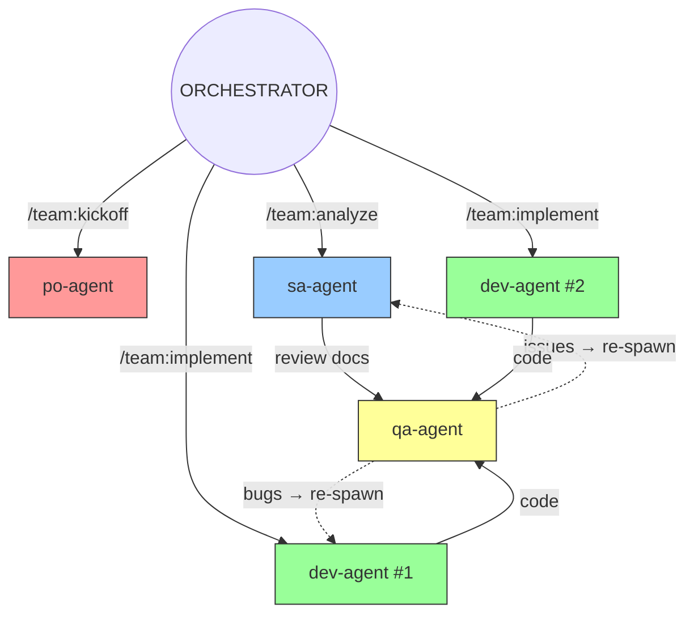
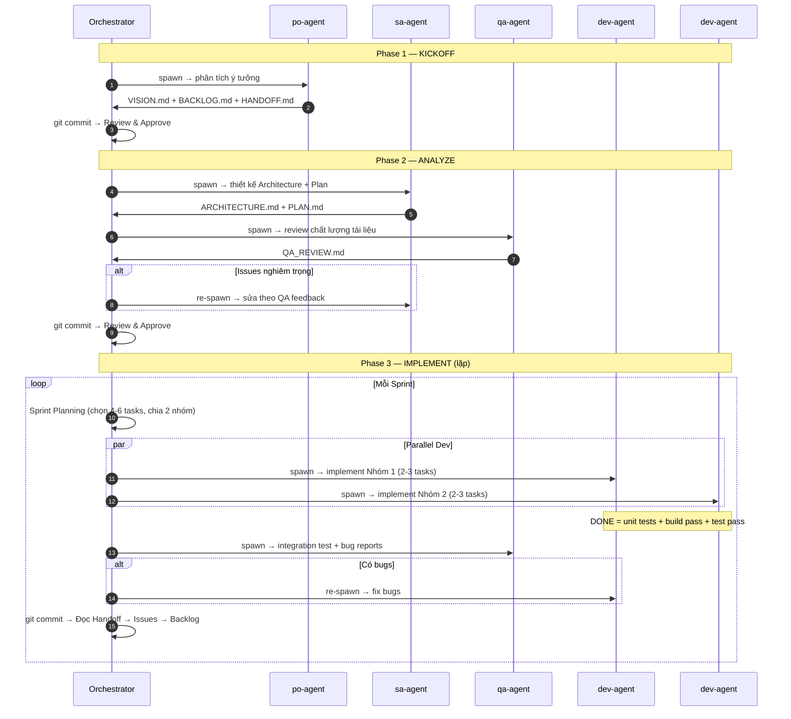

# SCRUM-SUBAGENTS: Mô hình Đội ngũ Agentic SE

---

## 1. Cấu trúc Team

| Agent         | Nhiệm vụ                                      | Max Turns |
| :------------ | :-------------------------------------------- | :-------- |
| **po-agent**  | User Stories, AC, Backlog, Vision             | 15        |
| **sa-agent**  | Architecture, Tech Stack, Implementation Plan | 15        |
| **dev-agent** | Code + Unit Tests (build & test PHẢI pass)    | 15        |
| **qa-agent**  | Test Cases, Bug Reports, Doc Review           | 15        |

---

## 2. Quy trình — 3 Phase

| Phase | Command                   | Agents Spawned                          | Output                                 |
| :---- | :------------------------ | :-------------------------------------- | :------------------------------------- |
| 1     | `/team:kickoff <ý tưởng>` | po-agent                                | VISION.md, BACKLOG.md                  |
| 2     | `/team:analyze`           | sa-agent → qa-agent (→ sa-agent)        | ARCHITECTURE.md, PLAN.md, QA_REVIEW.md |
| 3     | `/team:implement <tasks>` | 2× dev-agent ∥ → qa-agent (→ dev-agent) | Code, Tests, BUG_REPORT.md             |

---

## 3. Definition of Done (Dev Agent)

Dev Agent chỉ được coi là **DONE** khi:

1. ✅ Code implemented theo Architecture
2. ✅ Unit tests viết cho mỗi function/component
3. ✅ `npm run build` (hoặc tương đương) — **PASS**
4. ✅ `npm test` — **PASS**
5. ✅ Viết HANDOFF file

> Nếu build/test fail → Dev PHẢI fix trước khi handoff. KHÔNG được trả kết quả khi tests đang fail.

---

## 4. Sprint Capacity Planning

| Metric                | Giá trị       |
| :-------------------- | :------------ |
| Max turns/agent       | 15            |
| Tasks/agent/sprint    | 2-3           |
| Dev agents/sprint     | 2 (song song) |
| **Tổng tasks/sprint** | **4-6**       |

Orchestrator chọn tasks phù hợp: không quá phức tạp, không phụ thuộc nhau (2 nhóm song song).

---

## 5. Handoff & Git Commit

Mọi agent viết `docs/HANDOFF_[ROLE].md`. Orchestrator **git commit** sau mỗi workflow:

- `phase1(kickoff): PO tạo Vision + Product Backlog`
- `phase2(analyze): SA thiết kế Architecture + Plan, QA reviewed`
- `phase3(sprint): [tóm tắt tasks] — tests passed`

---

## 6. Quy tắc

1. **Phase Gate**: Không nhảy phase. User approve mới sang tiếp.
2. **Explicit Spawn**: Commands spawn subagents, orchestrator KHÔNG tự code.
3. **Parallel Dev**: Phase 3 spawn 2 dev-agents song song cho throughput.
4. **Tests Must Pass**: Dev chưa pass tests = chưa done.
5. **Git Commit**: Mỗi workflow kết thúc PHẢI commit local changes.
6. **Issues from Handoff**: Việc dở → Issues → Backlog → Sprint sau.

---

_v7.0 — Generated by Antigravity_
