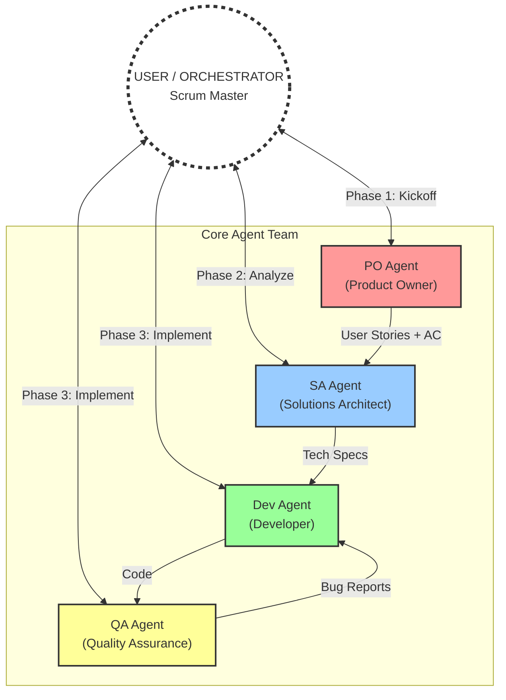
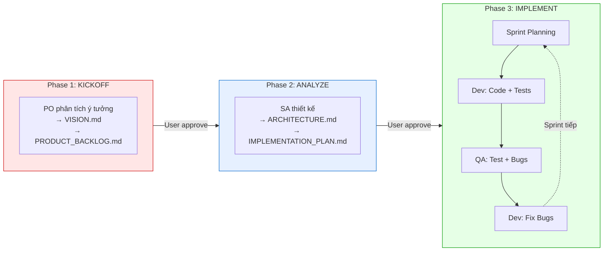
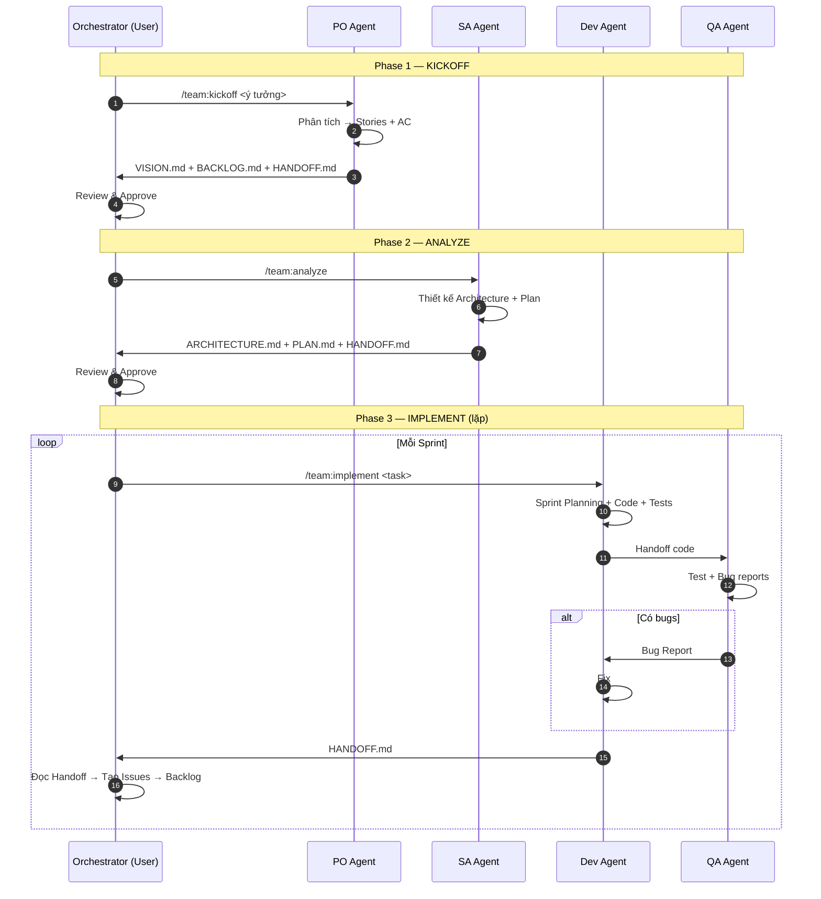

# SCRUM-SUBAGENTS: Mô hình Đội ngũ Agentic SE (3 Man-Month)

Tài liệu này định nghĩa cấu trúc, vai trò và quy trình phối hợp cho một đội ngũ SubAgents phát triển phần mềm theo Agile/Scrum.

---

## 1. Cấu trúc Team

Mô hình **Human-in-the-Loop (HITL)**: User là Orchestrator/SM điều phối, Agents là chuyên gia thực thi.



### Vai trò

| Agent    | Vai trò            | Nhiệm vụ chính                                                  |
| :------- | :----------------- | :-------------------------------------------------------------- |
| **User** | Orchestrator / SM  | Ra quyết định, điều phối, review, merge, tạo Issues từ Handoff  |
| **PO**   | Product Owner      | Phân tích ý tưởng → User Stories + AC, quản lý Backlog          |
| **SA**   | Solution Architect | Thiết kế kiến trúc, tech stack, API/DB, tạo Implementation Plan |
| **Dev**  | Developer          | Viết code + unit tests, fix bugs, refactor                      |
| **QA**   | Quality Assurance  | Viết test cases, chạy tests, báo cáo bugs                       |

---

## 2. Quy trình Phát triển — 3 Phase



| Phase        | Command                   | Agent    | Output                                       |
| :----------- | :------------------------ | :------- | :------------------------------------------- |
| 1. Kickoff   | `/team:kickoff <ý tưởng>` | PO       | `VISION.md` + `PRODUCT_BACKLOG.md`           |
| 2. Analyze   | `/team:analyze`           | SA       | `ARCHITECTURE.md` + `IMPLEMENTATION_PLAN.md` |
| 3. Implement | `/team:implement <task>`  | Dev + QA | Code + Tests + `HANDOFF.md`                  |

---

## 3. Handoff Protocol

Mọi agent có **max 15 turns**. Khi kết thúc phiên (dù xong hay chưa), agent **BẮT BUỘC** viết `docs/HANDOFF.md`:

```markdown
# Handoff Report — [Ngày]

## ✅ Đã hoàn thành

## 🔄 Đang dở (chưa xong)

## 📋 Issues cần tạo (cho Sprint sau)

## 🎯 Đề xuất bước tiếp

## 📝 Bài học rút ra (Retrospective)
```

### Orchestrator xử lý Handoff:

1. Đọc `docs/HANDOFF.md`
2. Mục "🔄 Đang dở" + "📋 Issues" → **Tạo Issue, bỏ vào `PRODUCT_BACKLOG.md`**
3. Gọi `/team:implement` tiếp với task cụ thể từ Issues

> Handoff thay thế Daily Standup — agents tự ghi lại kinh nghiệm và trạng thái, Orchestrator đọc và quyết định.

---

## 4. Quy trình Phối hợp



### Quy tắc:

1. **Phase Gate**: Không nhảy phase. Phải User approve mới sang phase tiếp.
2. **Single Source of Truth**: Mọi thông tin phải ghi vào `docs/`.
3. **Mandatory Handoff**: Agent kết thúc mà không viết Handoff = vi phạm quy trình.
4. **Issues from Handoff**: Orchestrator tạo Issues từ mục "Đang dở" của Handoff, bỏ vào Backlog.

---

_Docs version: 5.0 (Simplified 3-Command Workflow) - Generated by Antigravity_
