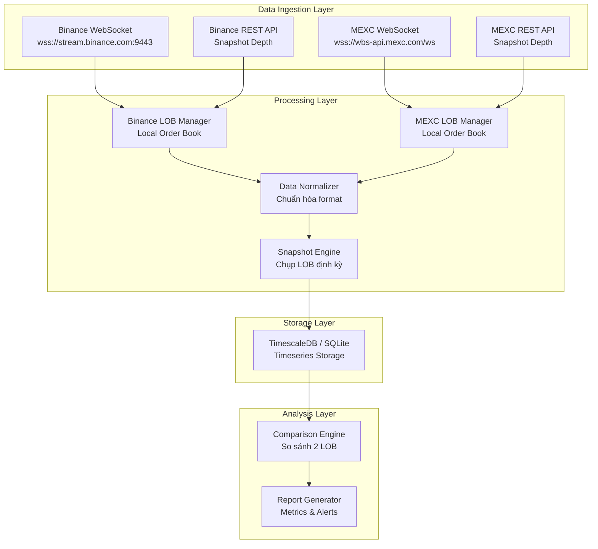

# Yêu Cầu: Hệ Thống Thu Thập & So Sánh Limit Order Book ETH/USDT (Binance vs MEXC)

## 1. Tổng Quan

Xây dựng hệ thống thu thập dữ liệu **spot trading** cho cặp **ETH/USDT** từ hai sàn giao dịch **Binance** và **MEXC**, lưu trữ vào database dạng **timeseries** để phân tích và so sánh sự sai khác giữa hai Limit Order Book (LOB) theo thời gian.

### Mục Tiêu Chính

- Thu thập realtime orderbook depth (bids/asks) từ cả Binance và MEXC
- Lưu trữ snapshot orderbook theo timeseries với timestamp chính xác (millisecond)
- Hỗ trợ truy vấn so sánh sai khác giữa 2 LOB tại cùng thời điểm

---

## 2. Kiến Trúc Hệ Thống



---

## 3. Nguồn Dữ Liệu

### 3.1 Binance Spot API

| Thành phần          | Chi tiết                                              |
| ------------------- | ----------------------------------------------------- |
| REST Depth Endpoint | `GET /api/v3/depth?symbol=ETHUSDT&limit=1000`         |
| WebSocket Stream    | `ethusdt@depth@100ms` (diff depth stream)             |
| Base URL WS         | `wss://stream.binance.com:9443/ws`                    |
| Versioning          | `lastUpdateId`, `firstUpdateId` → validate continuity |

**Quy trình duy trì Local Book (Binance):**

1. Lấy snapshot từ REST API
2. Subscribe diff depth stream qua WebSocket
3. Drop events có `u` (finalUpdateId) <= `lastUpdateId` của snapshot
4. Event đầu tiên phải có `U` <= `lastUpdateId+1` và `u` >= `lastUpdateId+1`
5. Apply updates: quantity = 0 → xóa price level

### 3.2 MEXC Spot API

| Thành phần          | Chi tiết                                                        |
| ------------------- | --------------------------------------------------------------- |
| REST Depth Endpoint | `GET /api/v3/depth?symbol=ETHUSDT&limit=1000`                   |
| WebSocket Stream    | `spot@public.aggre.depth.v3.api.pb@100ms@ETHUSDT`               |
| Base URL WS         | `wss://wbs-api.mexc.com/ws`                                     |
| Encoding            | **Protocol Buffers** (binary) — cần decode bằng protobuf schema |
| Versioning          | `fromVersion`, `toVersion` → validate continuity                |

**Quy trình duy trì Local Book (MEXC):**

1. Lấy snapshot từ REST API (`lastUpdateId`)
2. Subscribe diff depth stream (Protobuf-encoded)
3. Validate: `fromVersion` phải = `toVersion + 1` của message trước
4. Nếu `toVersion` < snapshot version → ignore (outdated)
5. Nếu `fromVersion` > snapshot version + 1 → gap detected → re-snapshot
6. Apply updates: quantity = 0 → xóa price level

---

## 4. Thiết Kế Database

Sử dụng **SQLite** (via `better-sqlite3`) — đơn giản, portable, zero-config, embedded trực tiếp trong ứng dụng Node.js.

### Schema Database

#### Bảng `orderbook_snapshots`

Lưu trữ metadata mỗi lần chụp snapshot orderbook.

```sql
CREATE TABLE orderbook_snapshots (
    id              INTEGER PRIMARY KEY AUTOINCREMENT,
    exchange        TEXT NOT NULL,            -- 'binance' | 'mexc'
    symbol          TEXT NOT NULL,            -- 'ETHUSDT'
    timestamp_ms    INTEGER NOT NULL,         -- Unix timestamp milliseconds
    best_bid_price  REAL NOT NULL,            -- Giá bid tốt nhất
    best_bid_qty    REAL NOT NULL,            -- Khối lượng bid tốt nhất
    best_ask_price  REAL NOT NULL,            -- Giá ask tốt nhất
    best_ask_qty    REAL NOT NULL,            -- Khối lượng ask tốt nhất
    mid_price       REAL NOT NULL,            -- (best_bid + best_ask) / 2
    spread          REAL NOT NULL,            -- best_ask - best_bid
    spread_bps      REAL NOT NULL,            -- spread tính bằng basis points
    bid_depth_10    REAL,                     -- Tổng volume 10 levels bid
    ask_depth_10    REAL,                     -- Tổng volume 10 levels ask
    book_version    INTEGER,                  -- lastUpdateId / toVersion
    created_at      DATETIME DEFAULT CURRENT_TIMESTAMP
);

CREATE INDEX idx_snapshots_time ON orderbook_snapshots(exchange, symbol, timestamp_ms);
```

#### Bảng `orderbook_levels`

Lưu chi tiết từng price level tại mỗi snapshot (top N levels).

```sql
CREATE TABLE orderbook_levels (
    id              INTEGER PRIMARY KEY AUTOINCREMENT,
    snapshot_id     INTEGER NOT NULL REFERENCES orderbook_snapshots(id),
    side            TEXT NOT NULL,            -- 'bid' | 'ask'
    level           INTEGER NOT NULL,         -- 0 = best, 1 = second best, ...
    price           REAL NOT NULL,
    quantity        REAL NOT NULL,
    cumulative_qty  REAL NOT NULL,            -- Tích lũy volume từ level 0
    UNIQUE(snapshot_id, side, level)
);

CREATE INDEX idx_levels_snapshot ON orderbook_levels(snapshot_id);
```

#### Bảng `spread_comparisons`

Bảng tổng hợp pre-computed cho so sánh nhanh giữa 2 sàn.

```sql
CREATE TABLE spread_comparisons (
    id              INTEGER PRIMARY KEY AUTOINCREMENT,
    symbol          TEXT NOT NULL,
    timestamp_ms    INTEGER NOT NULL,
    bn_bid          REAL NOT NULL,            -- Binance best bid
    bn_ask          REAL NOT NULL,            -- Binance best ask
    mx_bid          REAL NOT NULL,            -- MEXC best bid
    mx_ask          REAL NOT NULL,            -- MEXC best ask
    bn_mid          REAL NOT NULL,
    mx_mid          REAL NOT NULL,
    mid_diff        REAL NOT NULL,            -- mx_mid - bn_mid
    mid_diff_bps    REAL NOT NULL,            -- Chênh lệch tính bằng bps
    arb_buy_bn      REAL,                     -- Mua Binance bán MEXC: mx_bid - bn_ask
    arb_buy_mx      REAL,                     -- Mua MEXC bán Binance: bn_bid - mx_ask
    created_at      DATETIME DEFAULT CURRENT_TIMESTAMP
);

CREATE INDEX idx_comparisons_time ON spread_comparisons(symbol, timestamp_ms);
```

---

## 5. Tần Suất Thu Thập & Snapshot

| Tham số                   | Giá trị                   | Ghi chú                         |
| ------------------------- | ------------------------- | ------------------------------- |
| WebSocket update interval | 100ms                     | Diff depth stream từ cả 2 sàn   |
| Snapshot interval         | **1 giây**                | Chụp LOB snapshot mỗi 1s lưu DB |
| Orderbook depth lưu trữ   | **Top 20 levels**         | Đủ sâu cho phân tích spread     |
| REST re-snapshot          | Khi phát hiện version gap | Fallback mechanism              |

> **Lưu ý:** Với snapshot 1s, mỗi ngày sẽ tạo ~86,400 snapshots × 2 sàn = **172,800 records** trong bảng `orderbook_snapshots` và ~6.9M records trong `orderbook_levels`.

---

## 6. Chức Năng Phân Tích

### 6.1 So Sánh Timeseries

```sql
-- Truy vấn ví dụ: Chênh lệch mid-price giữa 2 sàn trong 1 giờ qua
SELECT
    timestamp_ms,
    mid_diff_bps,
    arb_buy_bn,
    arb_buy_mx
FROM spread_comparisons
WHERE symbol = 'ETHUSDT'
  AND timestamp_ms >= (strftime('%s','now') - 3600) * 1000
ORDER BY timestamp_ms;
```

### 6.2 Các Metrics Cần Tính

| Metric                      | Mô tả                                | Công thức                                                       |
| --------------------------- | ------------------------------------ | --------------------------------------------------------------- |
| Mid-price Spread            | Chênh lệch giá giữa trung bình 2 sàn | `mx_mid - bn_mid`                                               |
| Cross-exchange Spread (bps) | Tính bằng basis points               | `(mx_mid - bn_mid) / bn_mid × 10000`                            |
| Arbitrage Signal (Buy BN)   | Cơ hội mua Binance bán MEXC          | `mx_bid - bn_ask` (> 0 = có lời)                                |
| Arbitrage Signal (Buy MX)   | Cơ hội mua MEXC bán Binance          | `bn_bid - mx_ask` (> 0 = có lời)                                |
| Depth Imbalance             | Mất cân bằng orderbook               | `(bid_depth_10 - ask_depth_10) / (bid_depth_10 + ask_depth_10)` |
| Correlation                 | Tương quan biến động giữa 2 sàn      | Rolling Pearson correlation trên mid-price                      |

---

## 7. Technology Stack

| Layer          | Công nghệ                         | Lý do                                  |
| -------------- | --------------------------------- | -------------------------------------- |
| Language       | **Node.js (JavaScript)**          | Tận dụng skill `lib-mexc-js` đã có sẵn |
| Binance Client | `binance-connector` (npm)         | Official SDK                           |
| MEXC Client    | Custom WebSocket + `protobufjs`   | Skill `lib-mexc-js` + Protobuf decode  |
| Database       | **SQLite** (via `better-sqlite3`) | Zero-config, embedded, đủ cho MVP      |
| Scheduler      | `setInterval` + event loop        | Snapshot định kỳ                       |
| Logging        | `pino` hoặc `winston`             | Structured logging                     |

---

## 8. Cấu Trúc Thư Mục Dự Kiến

```
example-01/
├── YEU-CAU.md                  # (file này)
├── package.json
├── src/
│   ├── index.js                # Entry point
│   ├── config.js               # Cấu hình API keys, intervals
│   ├── exchanges/
│   │   ├── binance.js           # Binance LOB manager
│   │   └── mexc.js              # MEXC LOB manager (protobuf)
│   ├── database/
│   │   ├── init.js              # Khởi tạo schema SQLite
│   │   ├── writer.js            # Ghi snapshot vào DB
│   │   └── queries.js           # Truy vấn phân tích
│   ├── engine/
│   │   ├── snapshot.js          # Snapshot engine (interval)
│   │   └── comparator.js        # So sánh 2 LOB
│   └── utils/
│       ├── normalizer.js        # Chuẩn hóa data format
│       └── logger.js            # Logging utility
├── data/
│   └── orderbook.db             # SQLite database file
└── docs/
    └── ARCHITECTURE.md          # Tài liệu kiến trúc (tiếng Việt)
```

---

## 9. Yêu Cầu Phi Chức Năng

| Yếu tố             | Yêu cầu                                                        |
| ------------------ | -------------------------------------------------------------- |
| **Availability**   | Tự động reconnect khi mất kết nối WebSocket                    |
| **Data Integrity** | Validate version continuity, re-snapshot khi phát hiện gap     |
| **Storage**        | Auto-cleanup data cũ hơn 7 ngày (configurable)                 |
| **Monitoring**     | Log connection status, error rates, snapshot frequency         |
| **Performance**    | Xử lý được ≥ 20 updates/giây từ mỗi sàn mà không bị bottleneck |
| **Security**       | API keys lưu trong `.env`, không commit vào git                |

---

## 10. Các Bước Triển Khai (Phân Chia Sprint)

### Sprint 1: Foundation (MVP)

- [ ] Setup project, cài dependencies
- [ ] Implement Binance WebSocket + Local Book Manager
- [ ] Implement MEXC WebSocket + Protobuf decode + Local Book Manager
- [ ] Khởi tạo SQLite schema

### Sprint 2: Data Pipeline

- [ ] Implement Snapshot Engine (chụp LOB mỗi 1s)
- [ ] Implement Database Writer (ghi snapshot + levels vào DB)
- [ ] Implement Data Normalizer (chuẩn hóa format giữa 2 sàn)
- [ ] Test pipeline end-to-end

### Sprint 3: Analysis & Comparison

- [ ] Implement Comparison Engine (tính spread, arb signals)
- [ ] Tạo bảng `spread_comparisons` pre-computed
- [ ] Query functions cho phân tích timeseries
- [ ] Tạo CLI report đơn giản

### Sprint 4: Hardening

- [ ] Auto-reconnect logic
- [ ] Data retention / cleanup
- [ ] Logging & monitoring
- [ ] Documentation

---

## 11. Rủi Ro & Giải Pháp

| Rủi ro                            | Xác suất               | Giải pháp                                                  |
| --------------------------------- | ---------------------- | ---------------------------------------------------------- |
| MEXC Protobuf decode lỗi          | Trung bình             | Dùng schema từ skill `lib-mexc-js`, test kỹ                |
| WebSocket disconnect thường xuyên | Cao                    | Exponential backoff reconnect, heartbeat ping              |
| SQLite write bottleneck           | Thấp (với 1s interval) | Batch insert, WAL mode                                     |
| Clock skew giữa 2 nguồn data      | Trung bình             | Dùng local timestamp khi nhận data, không dùng server time |
| Rate limit bị hit khi re-snapshot | Thấp                   | Cooldown timer, chỉ re-snapshot khi thực sự cần            |
