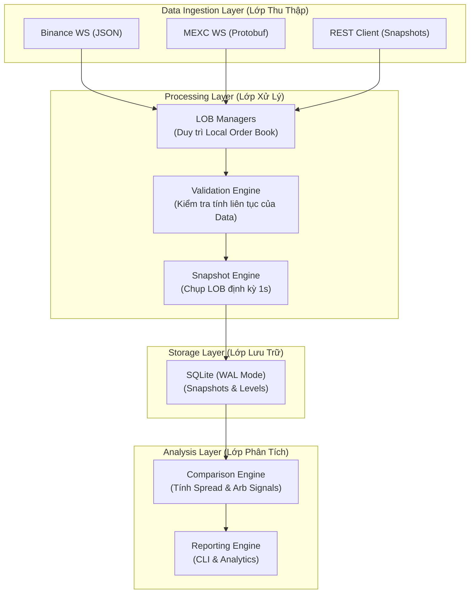

# Kiến Trúc Hệ Thống — LOB Collector & Comparator

## 1. Tổng Quan Kiến Trúc
Hệ thống được thiết kế theo kiến trúc **Event-Driven** kết hợp với **Layered Architecture** để đảm bảo tính thời gian thực và khả năng mở rộng trong việc tích hợp thêm các sàn giao dịch mới.

## 2. Các Thành Phần Chính (Components)

### 2.1 Data Ingestion Layer
- **Binance WS Client**: Kết nối đến stream `ethusdt@depth@100ms`, xử lý dữ liệu JSON.
- **MEXC WS Client**: Kết nối đến stream Protobuf, giải mã dữ liệu nhị phân bằng `protobufjs`.
- **REST Client**: Thực hiện fetch snapshot ban đầu và re-snapshot khi phát hiện mất dữ liệu (gap).

### 2.2 Processing Layer
- **LOB Managers**: Mỗi sàn có một manager riêng để duy trì cấu trúc dữ liệu Order Book (Bids/Asks) trong bộ nhớ, sắp xếp theo giá.
- **Validation Engine**: Kiểm tra `lastUpdateId` (Binance) và `version` (MEXC) để đảm bảo không có tin nhắn nào bị bỏ lỡ.
- **Snapshot Engine**: Sử dụng `setInterval` để định kỳ mỗi 1 giây lấy trạng thái hiện tại của cả 2 Local Books.

### 2.3 Storage Layer
- **SQLite Engine**: Sử dụng `better-sqlite3` với chế độ **WAL (Write-Ahead Logging)** để tối ưu hóa việc ghi dữ liệu tần suất cao mà không làm khóa việc đọc dữ liệu phân tích.

### 2.4 Analysis Layer
- **Comparison Engine**: Đối chiếu dữ liệu giữa 2 sàn tại cùng một timestamp, tính toán chênh lệch giá (Spread) và tín hiệu Arbitrage.

## 3. Luồng Dữ Liệu (Data Flow)
1. **Khởi tạo**: Hệ thống fetch Snapshot từ REST API để xây dựng Local Book ban đầu.
2. **Cập nhật**: WebSocket nhận các diff updates và apply vào Local Book.
3. **Lưu trữ**: Snapshot Engine chụp 20 levels tốt nhất mỗi giây và lưu vào DB.
4. **Phân tích**: Comparison Engine chạy sau khi snapshot được lưu hoặc theo yêu cầu để tạo dữ liệu so sánh.

## 4. Design Patterns
- **Observer Pattern**: WebSocket clients thông báo cho LOB Managers khi có dữ liệu mới.
- **Singleton Pattern**: Database connection và Configuration managers.
- **Strategy Pattern**: (Tương lai) Khi thêm sàn mới, chỉ cần implement interface LOB Manager tương ứng.
